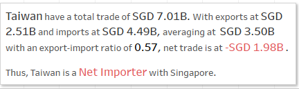

```{r setup, include=FALSE}
knitr::opts_chunk$set(echo = FALSE)
```

# 1.0 Critique of Visualisation

The original visualisation can be seen below as reference:


### 1.1 Critique of Clarity

**1. Hidden details**

Due to the circles being opaque and bad placement of the labels, some details are unclear. The centre point of the bubble will help viewers distinguish between “Net Importers” and “Net Exporters” however, in some cases, this centre point is hidden. E.g. Taiwan’s centre point was covered by United States’ label while Malaysia, EU and Republic of Korea have their centre point covered by other circles. As such, it is unclear where the centre point falls.

**2. Not hidden but still unclear details**

Furthermore, Japan’s centre point falls between Exports and Imports. Unsure if Japan is a net exporter or importer.

**3. Lack of title and other explanatory text**

There is no title to the graph, so viewers are unsure what this graph is supposed to be for.

There is also a lack of dates, thus viewers are unsure which period this graph is about. The tooltip talks about dates like 2009 and 2006 but we are unsure of how did this tooltip come about from the graph.

Furthermore, there is no explanation on which markets the EU consists of, especially since Brexit, this might need to be clarified. There are also 2 entries from Republic of Korea in the data (one is Democratic), clarification about which was used should be written.


### 1.2 Critique of Aesthetics

**Colours**

While Net Importer and Net Exporter colours were good as they are both mild on the eyes and distinguishable from each other, there is just way too many colours on the graph which makes it hard to focus on the details. Furthermore, some colours were indistinguishable from each other, e.g. Thailand and EU have  purple-blue tones and it is not easy to tell them apart. Japan is yellow and yellow font on white background is not a good idea. Further more, dotted yellow lines tend to become invisible. EU's colour contrasts too strongly with Malaysia's colour, this causes distress to the eyes and a reddish outline due to the visual illusion this causes (chromostereopsis).

**Hidden Tooltips**

Due to the circles being opaque, some labels are partially hidden (e.g. Malaysia and Indonesia) 

**Use of icons and ambiguous location of axis labels**

There is not much of a point to add the icons to Exports and Imports since we can already tell from the text. Plus it confuses the viewers’ eyes since Exports is above Imports which could possibly confuse viewers at first glance, since net exporters are technically below net importers on the graph.

# 2.0 Suggest Alternative Graphical Presentation

The plan is to create a dashboard with an interactive graph that allows switching the graph through the years by the use of a dropdown list. The goal is to clearly answer the following: 

1. Which market had higher trade with Singapore during the period?

2. Was the market a net importer or exporter with Singapore?

3. What was the proportion of exports vs imports?

Also, a static table will be placed in the dashboard so that viewers who want answers on market rankings in terms of total trade volume across the years can get their answers as fast as possible without the interactive graph.

The graph and the table are meant to complement each other in the sense that the graph will give more details to the table.


The dashboard will have the following:

* One interactive graph for Export, Import and Average for the markets across the periods
* One static table for rankings of markets based on total trade volume with Singapore

To note, the tooltip for the interactive graph will contain the following information for the respective periods:

* Total trade
* Net trade
* Whether the market is a net importer or exporter
* Total exports
* Total imports
* Export-import ratio


### 2.1 Improvement to Clarity

1. Titles and subtitles to explain graphs more clearly. 
2. Tooltips show more relevant information. See previous section for said information.
3. Imports and Exports will be on the same axis to easily compare them.
4. Dates will clearly be shown.
5. Clarification on ambiguous markets like EU and Republic of Korea will be given.
6. Tooltips will only appear when hovering over specific portions of the interactive graph, which allows viewers to see the graph properly before reading the tooltip.
7. There is no opague overlap between markets and they are clearly segmented.
8. Net importers and exporters will be clearly coloured to distinguish between them.

### 2.2 Improvement to Aesthetic

1. There will not be any opague elements that will overlap with other elements so everything will be shown clearly. Other than tooltips which will only appear when hovered over.
2. Only 3 colours will be present in the graph to avoid confusing viewers. Black, pink and green.
3. Removal of unneeded visuals like icons that do not add to the value of the visual.


# 3.0 Alternative Graphical Presentation


Please view the interactive dashboard on Tableau Public [here](https://public.tableau.com/app/profile/joyce.woon/viz/DataViz2_16240401638120/Dashboard1).

For a preview of the individual graph, table and tooltips, please refer to 6.0 Appendix.

# 4.0 Data Visualisation Preparation

### 4.1 Data Source

##### 4.1.1 Creating the tables

1. Open the excel file in Tableau.
2. Check "Use Data Interpreter" in Data Source.
3. Under data source, drag T1 and T2 into the white space as such and edit their relationship so that Variables = Variables (T2)


##### 4.1.2 Preparing the table

1. Select all the date columns of T1, right click on the column and click Pivot. Repeat for T2.
2. Right click and delete the following columns:

| Table |          Column          |
|:-----:|:------------------------:|
|   T1  |    Variables - Split 2   |
|   T2  | Variables (T2) - Split 2 |


3. Right click Pivot Field Values in T1 and click Create Calculated Field. Rename the calculated field to Values (Import) and enter the following calculation before clicking OK:

> IF [Variables  - Split 1] = 'European Union'
> 
> THEN [Pivot Field Values]*1000
> 
> ELSE [Pivot Field Values]
> 
> END

4. Right click Pivot Field Values in T2 and click Create Calculated Field. Rename the calculated field to Values (Export) and enter the following calculation before clicking OK:

> IF [Variables (T2) - Split 1] = 'European Union'
> 
> THEN [Pivot Field Values (Pivot1)]*1000
> 
> ELSE [Pivot Field Values (Pivot1)]
> 
> END

> Steps 3 and 4 need to be done as European Union were in Millions while the rest of the markets were in Thousands.

5. Right click on the respective columns and rename as follows:

| Table |    Original Name    | New Name |
|:-----:|:-------------------:|:--------:|
|   T1  |  Pivot Field Names  |   Dates  |
|   T1  | Variables - Split 1 |  Markets |

> The reason why we do not rename the rest of the columns is because we are not using them during the course of this visualisation.

6. Click on the Abc on the Dates column in T1 and click Date. Repeat the same for Pivot Field Names (T2) in T2.

##### 4.1.3 Adding filters

1. On the top right of Data Source under Filters, click add. 
2. Under Edit Data Source Filters, click add…. Select Dates, click OK, select $ Years, click Next, check 2011 to 2020 and press OK. Repeat for Pivot Field Names (Pivot 1) in T2.
3. Under Edit Data Source Filters, click add…. Select Markets (Export), click OK, select Malaysia, Mainland China, European Union, United States, Taiwan, Japan, Republic of Korea, Indonesia, Thailand and Hong Kong and press OK. Repeat for Variables (T2) – Split 1 in T2.

By the end of this step, Edit Data Source Filters should look like this.


### 4.2 Interactive Graph

##### 4.2.1 Creating Calculated Fields

1. Click Sheet 1.
2. On the left panel, there is a black triangle. Click the black triangle, click Create Calculated Field and create the following fields:

| Field Name           | Formula                                                                                                     | Usage                           |
|----------------------|-------------------------------------------------------------------------------------------------------------|---------------------------------|
| Total                |     [Values (Export)]+[Values (Import)]                                                                     | Dates                           |
| T1                   |     ([Values (Export)]+[Values (Import)])/2                                                                 | Markets                         |
|     Net              |     [Values (Export)]-[Values (Import)]                                                                     |     For other fields            |
|     High             |     IF [Values (Export)]>[Values (Import)]     THEN [Values (Export)]     ELSE [Values (Import)]     END    |     For graph                   |
|     Low              |     IF [Values (Export)]<[Values (Import)]     THEN [Values (Export)]     ELSE [Values (Import)]     END    |     For graph                   |
|     Trade Type       |     IF SUM([Net])>0     THEN 'Net Exporter'     ELSE 'Net Importer'     END                                 |     For colour and tooltip      |
|     Ratio            |     [Values (Export)]/[Values (Import)]                                                                     |     For tooltip                 |
|     Exporter         |     IF [Trader Type]='Net Exporter'     THEN [Trader Type]     END                                          |     For tooltip                 |
|     Importer         |     IF [Trader Type]='Net Importer’     THEN [Trader Type]     END                                          |     For tooltip                 |
|     High-Export      |     IF [Trader Type]='Net Exporter'     THEN sum([High])     END                                            |     For tooltip                 |
|     High-Import      |     IF [Trader Type]='Net Importer'     THEN sum([High])     END                                            |     For tooltip                 |
|     Low-Export       |     IF [Trader Type]='Net Importer'     THEN sum([Low])     END                                             |     For tooltip                 |
|     Low-Import       |     IF [Trader Type]='Net Exporter'     THEN sum([Low])     END                                             |     For tooltip                 |
|     Exporter-Text    |     IF [Trader Type]='Net Exporter'     THEN 'exports are higher than imports'     END                      |     For tooltip                 |
|     Importer-Text    |     IF [Trader Type]='Net Importer’     THEN 'imports are higher than exports'     END                      |     For tooltip                 |
|     Exporter-Net     |     IF SUM([Net])>0     THEN SUM([Net])     END                                                             |     For tooltip                 |
|     Importer-Net     |     IF SUM([Net])<0     THEN SUM([Net])     END                                                             |     For tooltip                 |
|     Rank             |     RANK_DENSE(sum([Total]),'desc')                                                                         |     For static table (later)    |

##### 4.2.2 Creating the Graph

1. Drag Average to Columns and Markets to Rows. The graph should look like this:


2. Drag High and Low to the top of the graph. The graph should look like this:


3. Under Markets, Measure Values, click on the dropdown list that says Automatic and change to Line. The graph should look like this.


4. Under Markets, Measure Values, drag Measure Names, which is currently under Colour, to Path. The graph should look like this:


##### 4.2.3 Formatting Filters and Colours

1. Drag Dates into Filters, click Years and click Next. Under Filter [Year of Dates] select Use all instead of Select from list and click OK.
2. Under Filters, hover over Year(Dates) and click Show Filter.
3. On the right side, Year(Dates) will appear. Hover over it, click the black triangle and click Single Value (List).
4. Under Marks, All, drag Trader Type to Colour. The graph should look like this:


5. Right click Value on the graph and click Edit Axis. Under General, Axis Title, leave the Title empty. Under Tick Marks, Major Tick Marks, click None. Close the window.
6. Right click Average on the graph and click Edit Axis. Under Axis Title, rename the Title to Export, Import and Average Values (SGD) and close the window.
7. Hover over AGG(Trader Type), click the black triangle and Edit Colours. Choose the following colours:


8. Hover over AGG(Trader Type), click on the black triangle and Edit Title. Rename the title to Market Trade Type.


##### 4.2.3 Formatting Title and Tooltips

1. Go back to Sheet 1.
2. Change the title to “International Trade with Singapore, <Page Name>”.
3. Drag the following to the respective Marks under Tooltips:

|     Fields/Columns                                                                                                                                                        |     Marks             |
|---------------------------------------------------------------------------------------------------------------------------------------------------------------------------|-----------------------|
|     SUM(Total), AGG(Exporter), AGG(Importer), AVG(Ratio), AGG(High-Export),   AGG(High-Import), AGG(Low-Export), AGG(Low-Import), AGG(Exporter-Net), AGG(Importer-Net)    |     SUM(Average)      |
|     AGG(High-Import), AGG(Low-Export), AGG(Low-Import), AGG(Exporter-Net),   AGG(Importer-Net), ATTR(Markets), AGG(Importer-Text), AGG(Exporter-Text)                     |     Measure Values    |

Drag Total, Net, Values (Import), Values (Export), Ratio, Exporter and Importer to Tooltip, under Marks, All. 

4. Hover over SUM(Ratio) under Marks, SUM(Average), click the white triangle, hover over measure and click Average.
5. Click Tooltip under Marks, SUM(Average) and, before clicking OK,  edit the field to the following:


6. Click Tooltip under Mark, Measure Values and, before clicking OK, edit the field to the following:


7. Right click the respective marks, click Format and format as follows:

> Under Pane, Default. Click the dropdown list for Numbers, choose Number (Custom), change display units to Billions, and prefix with “SGD “.
> 
> The marks to be formatted with the same step above is as follows:
>
> SUM(Total), SUM(Average), AGG(High-Export), AGG(High-Import), AGG(Low-Export), AGG(Low-Import), AGG(Exporter-Net), AGG(Importer-Net)
> 
> Make sure all the tooltips above for both SUM(Average) and Measure Values are formatted accordingly.

##### 4.2.4 Adding Animation

1. Under Format, click Animations.
2. Turn Workbook Default to On, Duration 0.50 seconds.
3. Drag Year(Dates) from Filter to Pages.
4. Click Title and edit as follows:


### 4.3 Static Table

##### 4.3.1 Creating Static Table

1. Create new sheet and go to Sheet 3.
2. Drag Year(Dates) into Columns, Markets into Rows, Rank into Text, under Marks, Trader Type into Colour, under Marks and Total into Detail, under Marks.
3. Click Show Me and make sure it is a table.
4. Hover over Rank, under Marks, click the white triangle, hover over Computer using, click Table (Down).
5. Hover over Markets on the table, click the black triangle, hover over Field, click SUM(Total) and sort the Markets from highest SUM(Total) to lowest.
6. Under Marks, click Text and the … Edit the text to font size 12 and bold.
7. Double click the title and edit it as follows:


8. Under Marks, click Tooltip and leave the Tooltip blank.
9. Under Analytics, click and drag totals to Row Grand Totals.
10. Right click Grand Total in the table and click format. Under Header, Grand Totals, rename Label to Overall.

### 4.4 Dashboard

##### 4.4.1 Adding in Interactive Graph

1. Create new Dashboard and Drag Sheet 1 into the white space.
2. Hover over filter, click the black triangle and ensure it is Single Value (Dropdown) if it is not yet that.
3. Click on the Interactive Graph on the Dashboard. On the top, there is a dropdown list that reads Automatic. Click it and choose Entire View.

##### 4.4.2 Adding in Static Table

1. Drag Sheet 3 below Sheet 1 on the Dashboard
2. Click on the Static Table on the Dashboard. On the top, there is a dropdown list that reads Automatic. Click it and choose Entire View.

##### 4.4.3 Adding in Text Boxes and Other Formatting

1. On the bottom left of the screen, check Show dashboard title and edit the title as follows:


2. Drag a Text box below Market Trade Type and edit the text to the following:


3. Under Size, change Dashboard size to 1000x1000 and adjust the heights of the various elements to fit into the Dashboard.

# 5.0 Derived Insights

1. Export/Import: Hong Kong has the largest Export/Import ratio with exports being approximately as high as Malaysia (rank 2 in total trade). However, due to low imports, ranking in Total Trade is low.

2. Net Exporter/Importer: Most countries do not change from Net Exporter to Net Importer or vice versa throughout the years. The only markets that experienced changes were Mainland China, Malaysia and Republic of Korea.

3. Total Trade: Unlike the above, markets do change in ranking in terms of total trade with Singapore. The only markets that do not exhibit change are Mainland China and Malaysia with the top 2 ranks and Thailand with the last rank.The markets that exhibit change were EU and US, which changed between ranks 4 and 5, Indonesia, Hong Kong, Taiwan, Japan and Republic of Korea are more volatile and changed between ranks 6 to 9.

# 6.0 Appendix

**Interactive Graph**


**Static Table**


**Tooltip Graph**


**Tooltip (For middle circle, Net Exporter)**


**Tooltip (For middle circle, Net Importer)**



**Tooltip (For lines, Net Exporter)**


**Tooltip (For lines, Net Importer)**


