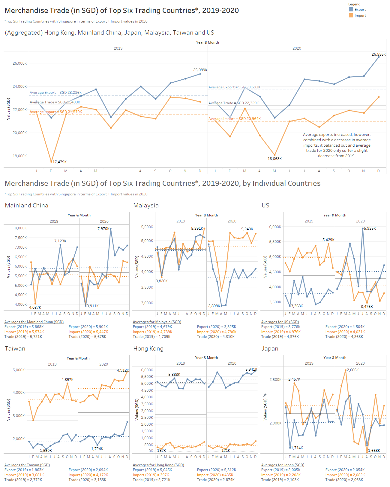
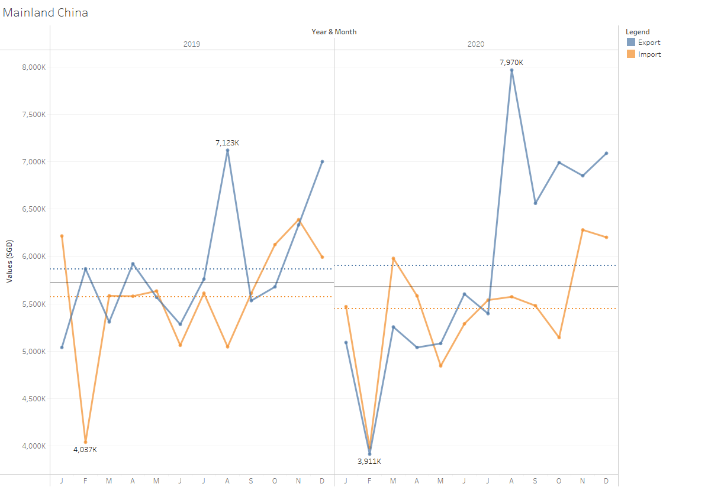
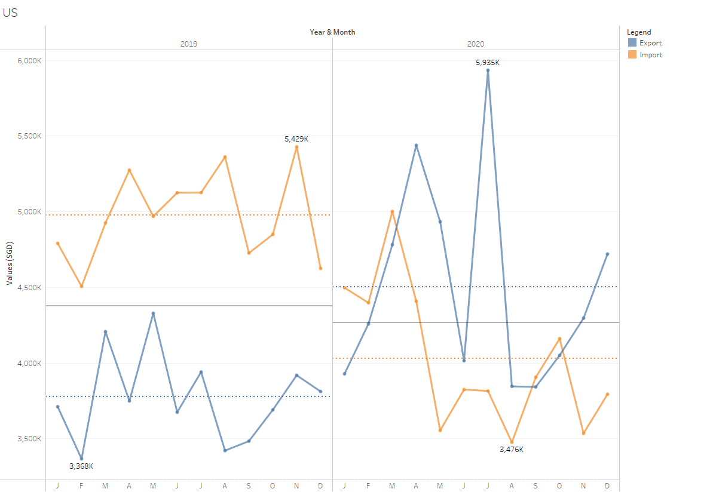
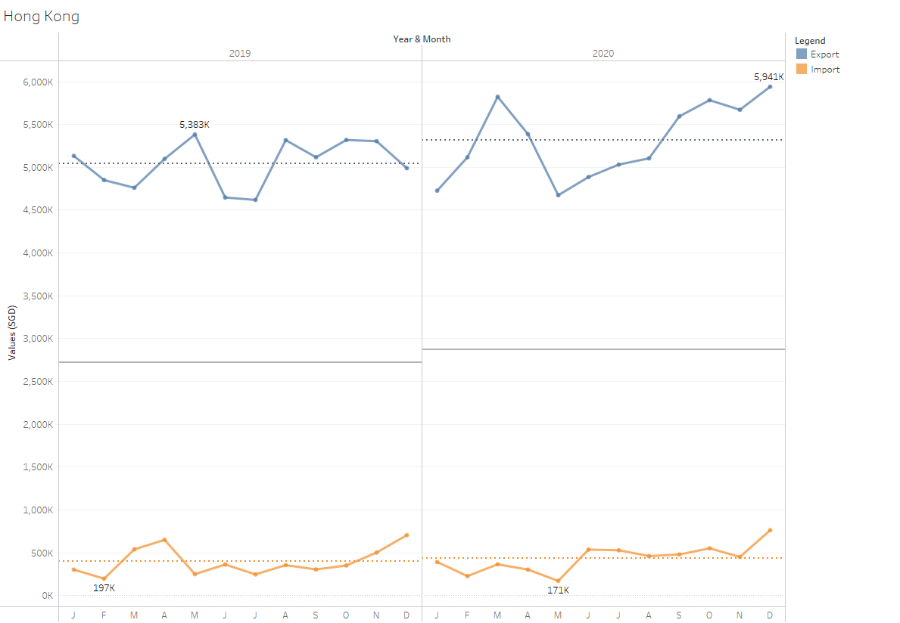

```{r setup, include=FALSE}
knitr::opts_chunk$set(echo = FALSE)
```

# 1.0 Critique of Visualisation

The original visualisation can be seen below as reference:


### 1.1 Critique of Clarity

**Pros**

1. Y-axis starts from 0 which makes it easy to understand.
2. Matching the graphs with the country it is meant for is very clear due to the country headers.
3. Area chart was used instead of just dots for time series, making it clearer to understand than if just dots were used.

**Cons**

*Title and Annotations*

1. Title is ambiguous as it could either be for the six individual countries or an aggregation of the top six trading countries. Also, it did not specify top six trading countries to which country.
2. There are no annotations, combined with the ambiguous title, viewers are unsure what the graphs are supposed to explain.

*Y-axis*

1. Unsure how are imports and exports measured due to lack of information on the Y-axis. The numbers could mean many different things, including volume, costs, etc.
2. Y-axis is confusing due to different intervals used for imports and exports. Due to this, it is not possible to compare import and export volume. For example:

    + Hong Kong's exports are in intervals of 2M up to 6M and imports are in intervals of 200k up to 800k. At first glance, a viewer might think the difference between exports and imports are not that great, however, this is inaccurate.
    + Japan has the same intervals for exports and imports but have different interval spacing with imports having less space between intervals. Even with the same intervals, it is not possible to accurately gauge the difference between exports and imports.
3. All the graphs have values above max Y-axis value provided. Due to this, it is not clear to viewers how high the values actually go unless a ruler is used to measure the proportion. The following graphs have this issue:

    + Hong Kong’s exports go over 6M
    + Mainland China’s imports go over 6M
    + Japan’s exports and imports go over 2M
    + Malaysia’s exports go above 4M
    + Taiwan’s exports go above 2M and imports go above 4M
    + US’s exports go over 4M

    
*X-axis*

1. X-axis is confusing as it starts from 2019 to 2021 although the title stated that the graphs are for the period of 2019-2020. 

    + Due to lack of months, it is not possible to gauge which month was in the graphs, or if it was even in chronological order. Thus, it is also not possible to compare between both years as viewers are unsure if the months match between graphs.
    + Japan's graph is especially confusing as the X-axis only has 2020. Counting the number of peaks, there are 10 peaks. However, viewers are still unsure whether there really was only 10 months in this graph.
    
*Others*

1. For some parts of the graph, viewers are unable to tell whether the imports are the same or if there is a difference between them. For example:


### 1.2 Critique of Aesthetics

**Pros**

1. Complementary colours (colours on opposite ends of the colour wheel) of orange and blue were used giving a good contrast between exports and imports. The hue and saturation made it softer and easier on the eyes.
2. No "junk" like excessive usage of colours, 3D effects, etc.
3. The graphs are spaced out and viewers can easily tell which graphs are meant for which country.

**Cons**

*Colour*

1. Although relatively simple natural colours were used, the transparency on the area chart makes the graph complicated and not intuitive for viewers to understand. For example:

    + The difference between exports and imports could be either blue or orange.
    + The lower volume (either exports or imports) will always be a mixture between both colours.

*Size*

1. The graph sizes are not equal in terms of width. From longest to shortest, the graphs are as follows: Malaysia, Mainland China, US, Hong Kong, Taiwan and Japan. This makes the visual look messy.
2. The entire visual on the website was very small even when viewed from a big screen and even worse when viewed on tablet or phone. Many details were lost and the words are too small. Usually, grey font is alright, however, at this size, the grey font is very difficult to read. Enlarging the image does help, however, there are clarity issues as explained in *1.1 Critique of Clarity, Cons, Others, 1*.

*Others*

1. There are gridlines for exports but no gridlines for imports making it even more difficult to view the graph.
2. There is a lot of space underutilised due to the Y-axis starting from 0.

# 2.0 Suggest Alternative Graphical Presentation

The plan is to create a dashboard with an aggregation of the Top Six Trading Countries with Singapore followed by the individual graphs. This is based on the assumption that we want to observe how imports and exports have changed between the years and the relationship between imports and exports, i.e. which is higher at any one point. The individual graphs that follow after are for a more detailed dive into what goes into the aggregated graph.

Also noted that the graph has to be a static graph.

Suggest to have a poster-sized Data Visualisation by utilising the Dashboard as follows:


The dashboard will have the following:

* One aggregated line chart
* Six line charts for individual countries

Decided to start with a huge line graph which has the aggregated values from all top six trading countries. This is to set the story with the viewer. The goal of this data visualisation is to compare the average trade between the years to see if there are any changes, followed by seeing what caused the change, which could be changes in average export and/or average import. The viewer is then able to dive deeper into the details by looking at the trade data for individual countries.

We have noted that Top Six Trading Countries with Singapore for 2019-2020 is actually Mainland China, Malysia, US, Taiwan, Hong Kong and Indonesia, however, if we only consider 2020 data, the Top Six Trading Countries is actually the same as the original Data Visualisation. We have decided to keep the original six and put a note in the Data Visualisation on how the Top Six Trading Countries were chosen. *Refer to Appendix 6.2 for more information*


### 2.1 Improvement to Clarity

1. Title and Subtitles to explain graphs more clearly. Suggest to add an overall aggregated graph for Top Six Trading Countries with Singapore more clearly.
2. Annotations are added to periods where difference between exports and imports are unclear.
3. Imports and Exports will be on the same Y-Axis to allow viewers to be able to compare import and export volume.
4. Y-axis values are in SGD.
5. Y-axis marks will always be in intervals of 500k unless it is for the aggregated graph. This is to allow easier comparison between countries. This treatment will not be applied to aggregated graph as this will cause the Y-axis to become overcrowded. Also, it does not really make sense to compare an individual country to the aggregate data as the numbers are very different.
6. X-axis will now be divided into 2019 and 2020 and further subdivided into the months to make it clear that the months are in chronological order and there was no month missing.
7. The min/max values will be marked per pane so viewers do not have to guess if the lines go above the maximum Y-axis marks.
8. Reference lines to denote averages for export, import and trade will be added for easier comparison between the years.

### 2.2 Improvement to Aesthetic

1. Line graphs were used instead of area chart to make the graphs simpler than before.
2. Y-axis will not start from 0 to allow better use of the space and make it easier on the eyes to find differences between exports and imports.
3. The graph sizes will be standardised.


# 3.0 Alternative Graphical Presentation



Please view the dashboard on Tableau Public [here](https://public.tableau.com/app/profile/joyce.woon/viz/DataViz1_16223214044900/Dashboard).

*Refer to Appendix 6.1 for the Individual Graphs*

# 4.0 Data Visualisation Preparation

### 4.1 Data Source

1. Open the excel file in Tableau.
2. Check "Use Data Interpreter" in Data Source.

{width=50%}

3. Drag T1 into "Drag tables here".
4. Drag T2 under T1 to form a union.
5. Create "Legend" Group using "Table Name" and renamimng "T1" to "Import" and "T2" to "Export"
6. Select and hide unneeded columns. The columns that were hidden are as follows:
    
    + Dates that do not fall between 2019 Jan and 2020 Dec
    + "Sheet"
    + "Table Name"
7. Select all the date columns and pivot.
8. Rename the newly pivoted columns.

    + "Pivot Field Names" to "Year & Month".
    + "Pivot Field Value" to "Values (SGD)".
    + "Variables" to "Countries.
9. Change "Year & Month" column format from string to date.

After Step 9, the Data Source tab should look like this:

10. Rename "Countries" to "Countries (Original)".
11. Right click "Countries" and click split.
12. Rename "Countries (Original) - Split 1" to "Countries"
13. Hide both "Countries (Original)", "Countries (Original) - Split 2" and "Table"
14. Add a Filter with Countries and select "Mainland China”, “Japan”, “Malaysia”, “Taiwan”, "Hong Kong" and “US”.

### 4.2 Individual Graphs

**Creating the Discrete Line Graph**

1. Go to Sheet 1.
2. Drag Year & Month to Columns twice. Set the first one to "Year" and the other to "Month". 

>Make sure when choosing "Year" and "Month" to choose from the first set (e.g. Month with grey tooltip May instead of May 2015).
3. Drag Values (SGD) to Rows. It will automatically be set to sum.

> The recommended graph after this step should be discrete line graph. If it was not set to this, click "Show Me" and change to discrete line graph.

4. Drag Legend to Colour under Marks. 

> The colours are already complementary colours blue and orange, which is simple enough and have contrast, thus there is no need to change it.

5. Click Colour. Under Effects, Markers, choose the middle option to have dots on the line graph.
6. Drag Countries to Filter. Right click Countries to show filter and select "Hong Kong".

> This step is to ensure that the graph only contains data for the selected country/countries.

**Formatting the X-axis and Y-axis**

1. Select all the dates in the X-axis, right click and format. Under Header, Default, Dates, choose "First Letter".

> Chose First Letter as it allows the letters to be shows horizontally and read natually instead of vertically.

2. Click on the Y-axis and choose Edit Axis. Untick "Include Zero".

> Some graphs have values way above zero leaving a lot of unused space which could be better utilised.

3. Right click on the Y-axis and Format. Under Axis, Numbers, change numbers to "Number (Custom)" with 0 Decimal Places and Display Units as "Thousand (K)".

**Creating Calculated Fields for Future Purpose**
1. Create two Calculated Fields "Export" and "Import"  as follows:

> IF [Legend]='Export'
>
> THEN [Values (SGD)]
>
> END

2. Create Calculated Field "Import" as follows:

> IF [Legend]='Import'
>
> THEN [Values (SGD)]
>
> END

5. Drag all the newly created Calculated Fields into Tooltip.

**Creating Reference Line (For Individual Countries)**

Note: This only has to be done once because when the tab is duplicated, there is no need to change this.

1. Right click the Y-axis and click on Add Reference Line.
2. Under Scope, click "Per Pane".
3. Under Line, ensure Value is "SUM(Export)" and "Average".
4. Under Line, ensure Label is "None".
5. Under Line, ensure Tooltip is "None".
6. Under Formatting, ensure that the line is the 4th option (2nd separated line) and thickness is the 2nd option from the left. Fill Above and Fill Below should be "None". Colour should be blue (0 down, 6 right).
7. Right click the reference line created and click Format.
8. Under Reference Line Label, Numbers, change number format to Currency (Custom) and ensure there is 0 decimal places, display units are in Thousands (K) and prefix is "SGD ".
9. Repeat Steps 1 to 8 for Import with the following changes:

> 3. Under Line, ensure Value is "SUM(Import)" and "Average"
>
> 6. Under Formatting, ensure that the line is the 4th option (2nd separated line) and thickness is the 2nd option from the left. Fill Above and Fill Below should be "None". Colour should be orange (0 down, 2 right).

10. Repeat Steps 1 to 8 for trade with the following changes:

> 3. Under Line, ensure Value is "SUM(Values (SGD))" and "Average"
>
> 6. Under Formatting, ensure that the line is the 2nd option (unbroken line) and thickness is the 2nd option from the left. Fill Above and Fill Below should be "None". Colour should be default.
>
> The reason for the line for Average Trade to be different from Export and Import is to clearly show viewers that this is the average for total trade which is derived from export and import and viewers can easily see whether trade has changed between the years without being confused with export and import.

**Tooltips**

1. Click on Tooltip and erase everything in the input box.

> This DataViz is supposed to be static, thus there should not be any Tooltips.


**Mark Labels**

1. Drag Values (SGD) into Label.
2. Click Label, tick "Show mark labels", under Marks to Label, choose "Min/Max" and under Scope, choose "Pane".

> The reason why this is done is because there are some values that go below or above the min or max markers on the Y-axis. This is to let viewers know what are the min/max values the lines can go to instead of relying on guesswork.

**Other Formatting**

1. Rename "Sheet 1" tab to "Hong Kong".
2. Change title to "Hong Kong"


**Duplicating to Create other Line Graphs**

1. Duplicate the "Hong Kong" tab to create sheets for “Mainland China”, “Japan”, “Malaysia”, “Taiwan”, “US” and “(Aggregated) Hong Kong, Mainland China, Japan, Malaysia, Taiwan and US”. 
2. Rename Title and Sheet name respectively.
3. For each of the above sheets, change the filter to the respective country/ countries.
4. For (Aggregated) Hong Kong, Mainland China, Japan, Malaysia, Taiwan and US, delete the reference lines and follow the instructions in the next section.

**Creating Reference Line (For Aggregated)**

1. Right click the Y-axis and click on Add Reference Line.
2. Under Scope, click "Per Pane".
3. Under Line, ensure Value is "SUM(Export)" and "Average".
4. Under Line, ensure Label is "Custom" and "<Computation> <Field Label> = <Value>"
5. Under Line, ensure Tooltip is "None"

> The reason why I chose not to have Tooltip is because the graph for aggregated countries is big and can afford to have the information written in the graph. This is also so that viewers can first have an idea of what the blue and orange reference lines mean before their eyes move on to the smaller individual countries graph.

6. Under Formatting, ensure that the line is the 3th option (separated line below the unseparated line) and thickness is the 2nd option from the left. Fill Above and Fill Below should be "None". Colour should be blue (0 down, 6 right).
7. Right click the reference line created and click Format.
8. Under Reference Line Label, Font, change font colour to blue (0 down, 6 right).
9. Under Reference Line Label, Numbers, change number format to Currency (Custom) and ensure there is 0 decimal places, display units are in Thousands (K) and prefix is "SGD ".
10. Repeat Steps 1 to 9 for Import with the following changes:

> 3. Under Line, ensure Value is "SUM(Import)" and "Average"
>
> 6. Under Formatting, ensure that the line is the 3th option (separated line below the unseparated line) and thickness is the 2nd option from the left. Fill Above and Fill Below should be "None". Colour should be orange (0 down, 2 right).
>
> 8. Under Reference Line Label, Font, change font colour to orange (0 down, 2 right).

11. Repeat Steps 1 to 9 for trade with the following changes:

> 3. Under Line, ensure Value is "SUM(Values (SGD))" and "Average"
>
> 6. Under Formatting, ensure that the line is the 2th option (unbroken line) and thickness is the 2nd option from the left. Fill Above and Fill Below should be "None". Colour should be default.
>
> The reason for the line for Average Trade to be different from Export and Import is to clearly show viewers that this is the average for total trade which is derived from export and import and viewers can easily see whether trade has changed between the years without being confused with export and import.

**Specific-graphs formatting**

1. Japan: Edit Y-axis, change Range to Fixed with Fixed Start at 1,650,000 and Fixed End at 2,650,000.
2. (Aggregated): Right click empty space in graph and add in annotation for area with "Average exports increased, however, combined with a decrease in average imports, it balanced out and average trade for 2020 only suffer a slight decrease from 2019.". Format the annotation by changing the shading to None.

### 4.3 Dashboard

1. Change size to 1300 x 1620
2. Tick "Show Dashboard Title" and rename to “Merchandise Trade (in SGD) of Top Six Trading Countries*, 2019-2020”. Font is Tableau Book, font size is 18, bold. Height of object is 50.
3. Insert Text object “*Top Six Trading Countries with Singapore” below. Font is Tableau Book, font size is 10. Height of object is 25.
4. Insert Horizontal object below, edit height to 400.
5. Insert Text object “Merchandise Trade (in SGD) of Top Six Trading Countries*, 2019-2020, by Individual Countries”. Font is Tableau Book, font size is 18, bold. Height of object is 50.
6. Insert Text object “*Top Six Trading Countries with Singapore” below. Font is Tableau Book, font size is 10. Height of object is 25.
7. Insert Horizontal object below, edit height to 400.
8. Drag Hong Kong, Mainland China and Japan into the above Horizontal object, side by side. Select and delete all the filters that appear. Select the Horizontal object and distribute contents evenly.
9. Insert Horizontal object below, edit height to 76.
10. Insert six Text objects into the Horizontal object. It should be filled up as follows in Tableau Book font, font size 9, bold:

{width=100%}

9. Repeat the above two steps for the remaining countries. Of course, filling up the averages accordingly to the respective countries.

> It is important to use the Horizontal Objects so that we can adjust the height and then evenly distribute the content.

# 5.0 Derived Insights

1. With regards to the aggregated graph, average exports increased, however, average imports decreased. These two movements balanced out leading to a slight decrease in overall trade with Singapore.
2. Trade with Malaysia fell drastically between 2019 and 2020. The dip around March to May is probably because of Covid-19. Interestingly, Taiwan experienced the same dip but not that drastically. In the end, trade between Singapore and Taiwan recovered much better than Malaysia and there was an increase in overall trade with Taiwan with both exports and imports increasing.
3. Trade with Mainland China, Hong Kong, Japan and US did not experience a drastic change.

> There are some interesting observations to be made as follows:
> 
> The increase and decrease in US exports and imports respectively were the biggest change among all individual countries. Even though there was a big change, exports and imports basically switched positions and balanced out, leading to a not very drastic change in overall trade with Singapore.
> 
> Japan's imports decreased while their exports increased. This balanced out, leading to a not very drastic change in overall trade with Singapore.
>
> There was not much change for imports and exports in Mainland China and Hong Kong with Singapore

# 6.0 Appendix

### 6.1 Individual Graphs

(Aggregated) Hong Kong, Mainland China, Japan, Malaysia, Taiwan and US

 Hong Kong, Mainland China, Japan, Malaysia, Taiwan and US.png)

Mainland China



Malaysia


US



Taiwan


Hong Kong



Japan


### 6.2 Top Six Trading Companies

2019-2020: Indonesia, instead of Japan, is in the Top Six


2020: Japan, instead of Indonesia, is in the Top Six


